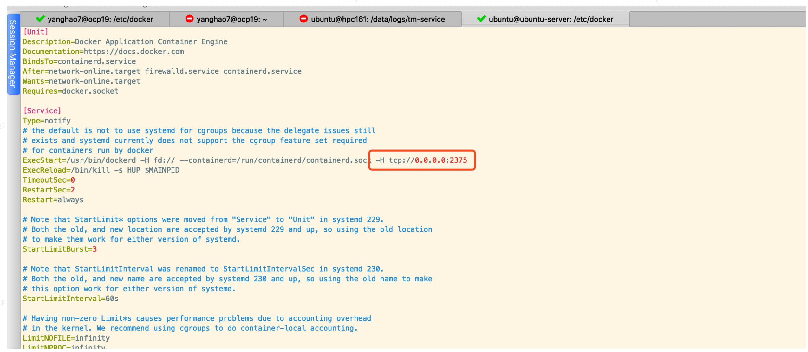
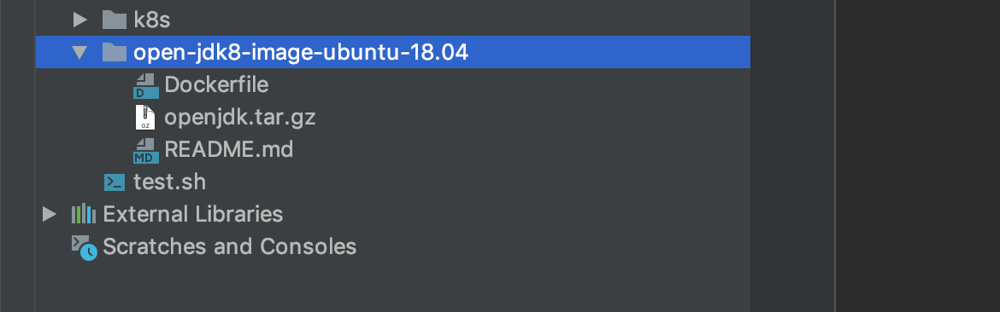

[TOC]

#### 容器化（Containerization）

容器化是一种虚拟化技术，又称操作系统层虚拟化（Operating system level virtualization），这种技术将操作系统内核虚拟化，可以允许用户空间软件实例（instances）被分割成几个独立的单元，在内核中运行，而不是只有一个单一实例运行。这个软件实例，也被称为是一个容器（containers）。对每个实例的拥有者与用户来说，他们使用的服务器程序，看起来就像是自己专用的。

相对于传统的基于虚拟机的虚拟化技术，容器化的优势在于占用服务器资源空间少，启动非常快，通常几秒内即可引导，缺点就是隔离性和安全性没有VM技术高。


#### docker

开源的应用容器引擎。


#### docker代理配置

```
1. 修改配置文件
vi /etc/docker/daemon.json
{
"registry-mirrors": ["https://uidzfqn8.mirror.aliyuncs.com"],
"insecure-registries": [
      "registry.tsingj.local",
      "10.18.0.19:5000"
  ]
}

2. 重启docker相关服务
sudo systemctl daemon-reload
sudo systemctl restart docker
```


#### ubuntu开启docker tcp端口

1. 修改docker文件

   sudo vi /lib/systemd/system/docker.service 

   如下图：

   

2. 重启docker服务

   重载守护进程 sudo systemctl daemon-reload

   重启Docker sudo systemctl restart docker

3. 测试

   docker -H tcp://10.88.200.191 images

   

#### docker cmds

**docker login**

```
格式：docker login [私服地址]
示例：docker login registry.tsingj.local 根据提示输入用户名、密码。
```

**启动容器**

```
docker run --name xxx -p 外部端口:内部端口 -d 注册中心地址/服务名:版本号
docker run --name seata-server-tsingj -p 8091:8091 -d registry.tsingj.local/seata-server-tsingj:0.5.0
```

**停止指定正在运行的容器**

```
docker stop [name]
```

**删除指定容器**

```
docker rm [name]
```

**文件copy**

```
1.宿主机copy文件到docker
	docker cp 文件路径 镜像名:路径   
	示例：docker cp /Users/yanghao/Downloads/main_tc tm-service:/tcengine

2.docker copy文件至宿主机
	docker cp 容器名:路径 copy的主机路径
	docker cp tm-service:/data/logs/tm-service.bin ./

3.小细节：
  docker cp 目录/ tm-service:目录
  目录以/结尾会将目录下的所有文件&目录cp至容器指定目录下，如果目录不存在会创建。
  docker cp 目录 tm-service:目录
  目录不以/结尾目录cp至容器指定文件夹下。
```

**查看image**

```
yanghaodeMacBook-Pro:auto_config yanghao$ docker images adoptopenjdk
REPOSITORY          TAG                           IMAGE ID            CREATED             SIZE
adoptopenjdk        8u212-b03-jdk-openj9-0.14.0   74dd9965bda8        10 months ago       325MB
yanghaodeMacBook-Pro:auto_config yanghao$ docker images | grep helloworld
helloworld                                  latest                         c5d0da5a1c26        3 months ago        119MB
registry.tsingj.local/helloworld            dev                            356e90a85150        3 months ago        119MB
```

**拉取image**

```
docker pull [注册中心]/[服务名]:[版本号]
docker pull registry.tsingj.local/console
```

**删除指定image**

```
docker image rm [id]
docker image rm c5d0da5a1c26
Untagged: helloworld:latest
Deleted: sha256:c5d0da5a1c26a9b79ff0a1680de7e9691f2c114eace0c7a3491893ce35dd6afe
Deleted: sha256:9866494c2380936e5a9797c369ef72033cc18c1c47f160c03008cf1119600b82
Deleted: sha256:46910521a9499a04213ecb627dfe597bd42bb11dee65cb0dfa7487f0a1b8f3f6
Deleted: sha256:ec131e80eb462467eee793b86defbf51d2f56a9db5ccf60bc335355a40705c24
Deleted: sha256:d8f8415b95e74c83109683e8556326521162b7853cf255572196ee23d178ed31
Deleted: sha256:58032e79d29eac1c9f5a47b2afe8d33ed1878d507995ed151306270661caf881
```

**批量删除none的image**

```
docker ps -a | grep "Exited" | awk '{print $1 }'|xargs docker stop
docker ps -a | grep "Exited" | awk '{print $1 }'|xargs docker rm
docker images|grep none|awk '{print $3 }'|xargs docker rmi
```

**查看日志** 

```
docker logs -f [name]
docker logs -f track-service
```

**查看最近日志**

```
docker logs --tail 500 [name]
docker logs --tail 500 track-service
```

**进入容器内部**

```
docker exec -it [name] bash | sh | /bin/bash
docker exec -it track-service /bin/bash
```


**自定义ubuntu docker image**

项目路径



dockerFile

```
FROM ubuntu:18.04
MAINTAINER  yanghao <yanghao@tsingj.com>

ENV LANG C.UTF-8
ENV TZ "Asia/Shanghai"


#openjdk8 jre
#https://github.com/AdoptOpenJDK/openjdk8-binaries/releases/download/jdk8u242-b08_openj9-0.18.1/OpenJDK8U-jre_x64_linux_openj9_8u242b08_openj9-0.18.1.tar.gz
ADD openjdk.tar.gz /opt/java/openjdk

ENV JAVA_VERSION jdk8u242-b08_openj9-0.18.1
ENV JAVA_HOME=/opt/java/openjdk/jdk8u242-b08-jre \
    PATH="/opt/java/openjdk/jdk8u242-b08-jre/bin:$PATH"
ENV JAVA_TOOL_OPTIONS="-XX:+IgnoreUnre"
ENV JAVA_TOOL_OPTIONS="-XX:+IgnoreUnrecognizedVMOptions -XX:+UseContainerSupport -XX:+IdleTuningCompactOnIdle -XX:+IdleTuningGcOnIdle"

RUN apt-get update && \
        apt install -y bzip2 libgomp1 tar tzdata wget unzip curl jq && \
        rm -rf /var/lib/apt/lists/* &&\
        ln -snf /usr/share/zoneinfo/$TZ /etc/localtime && \
        echo $TZ > /etc/timezone && \
        apt-get clean

RUN java -version
CMD ["/bin/bash"]
```

构建脚本

```shell
cd open-jdk8-image-ubuntu-18.04
#当前目录下的dockerfile为基准，构建整个文件夹
docker build -t openjdk8-ubuntu18:20200413 .
docker tag openjdk8-ubuntu18:20200413 registry.tsingj.local/openjdk8-ubuntu18:20200413
docker push registry.tsingj.local/openjdk8-ubuntu18:20200413

#指定其他目录dockerfile的方式
docker build -f /path/to/a/Dockerfile -t openjdk8-ubuntu18:20200413 .
```


