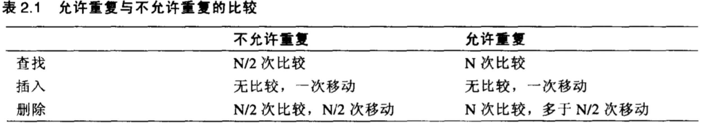
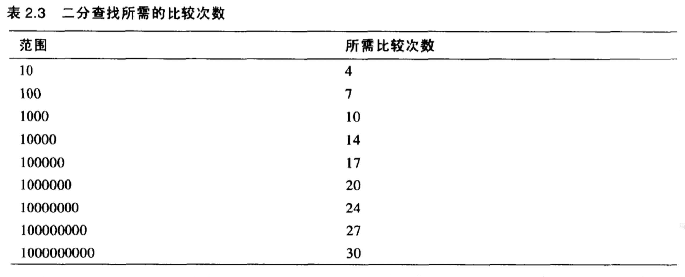
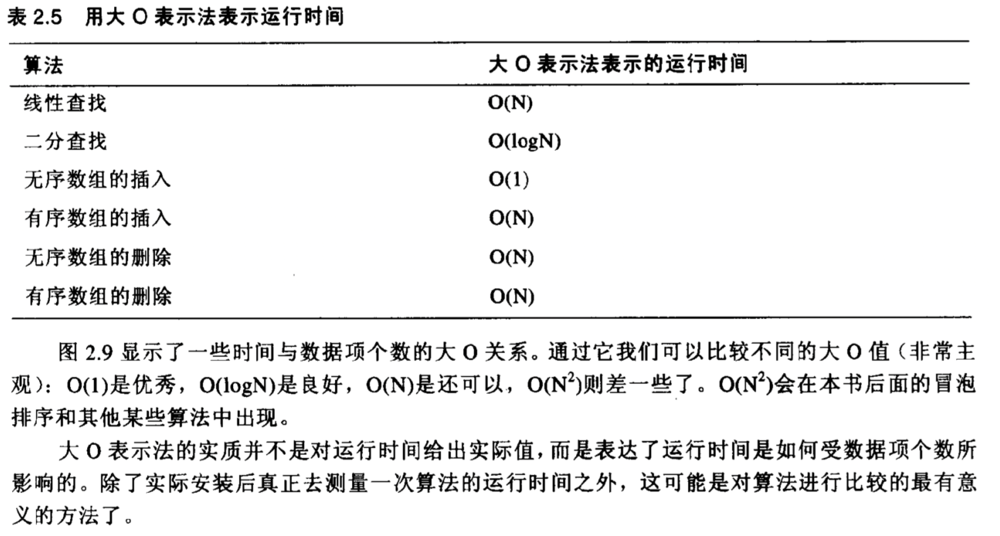
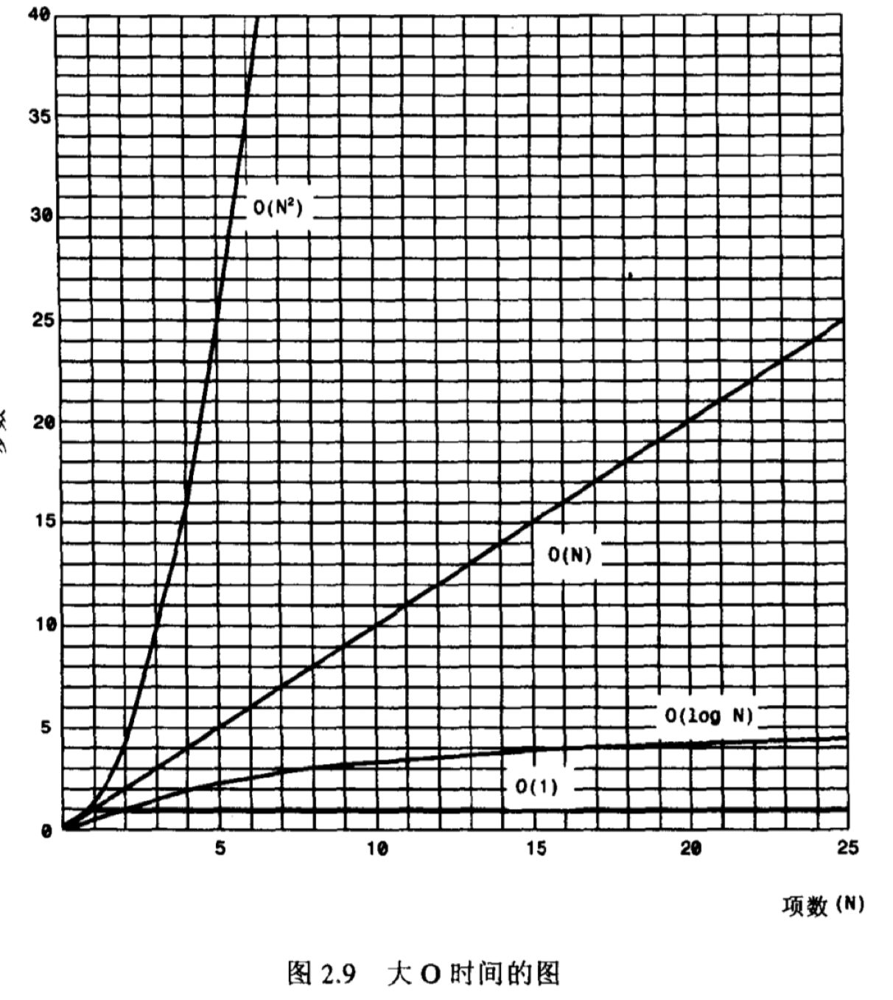

[TOC]

#### **概述**

最简单最基础应用最广泛的数据结构。

特殊的数组：有序数组，其中的数据按照关键字升序或降序排列。这种排序使快速查找成为可能：即可以使用二分查找。

**元素是否允许重复比较**

#### **线性查找**

从开始以此往后，寻找匹配。有序数组不同：查找到待查询大的数后退出。

#### **二分查找**

当使用二分查找时就体现出有序数组的好处，这种查找方式比线性查找快很多，尤其对大数组尤为显著。每查找一次就会将可能的值划分为两部分，最后范围会缩小到一个数字那么大，这就是答案。

#### **有序数组对比无序数组优缺点**

优点：查找使用二分查找速度比无序数组快很多

缺点：插入操作中，由于所有靠后的数据都需要移动腾开空间，所以速度较慢。

#### **大O表示法**

1. 运行时间表示

2. 运行时间轴

#### **小结**

- 无序数组可以提供快速的插入，但查找和删除较慢
- 有序数组可以使用二分查找
- 线性查找需要的时间与数组中数据项的个数成正比
- 二分查找需要的时间与数组中数据项的个数的对数成正比
- 大O表示法为比较算法的速度提供了一种方便的方式
- O(1)时间级的算法是最好的，O(logⁿ)次之，O(N)为一般，O(N²)最差