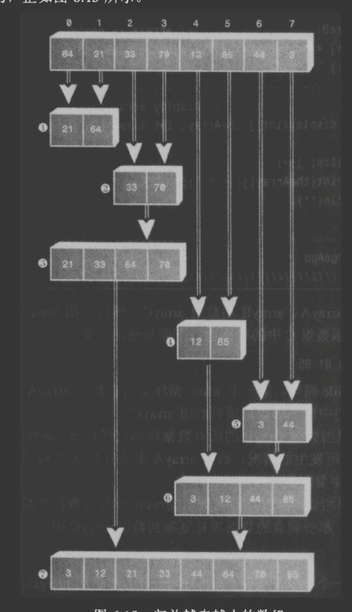

[TOC]

#### 简介

递归是一种方法(函数)调用自己的编程技术。

#### **特性**

1. 调用自身

2. 当它调用自身时，是为了坚决更小的问题。

3. 存在某个足够简单的问题的层次，在这一层算法不需要调用自己就可以直接解答，且返回结果。

#### **二分查找**

```
有序数组二分查找
package recursive.binary_search.simple;

class ordArray {
    private long[] a;                 // ref to array a
    private int nElems;               // number of data items

    //-----------------------------------------------------------
    public ordArray(int max)          // constructor
    {
        a = new long[max];             // create array
        nElems = 0;
    }

    //-----------------------------------------------------------
    public int size() {
        return nElems;
    }

    //-----------------------------------------------------------
    public int find(long searchKey) {
        int lowerBound = 0;
        int upperBound = nElems - 1;
        int curIn;
        while (true) {
            curIn = (lowerBound + upperBound) / 2;
            if (a[curIn] == searchKey) {
                return curIn; //found it
            } else if (lowerBound > upperBound) {
                return nElems; // can't found it
            } else {
                if (a[curIn] < searchKey) {
                    lowerBound = curIn + 1; //it's in upper half
                } else {
                    upperBound = curIn - 1; //it's in lower half
                }
            }
        }
    }


    //-----------------------------------------------------------
    public void insert(long value)    // put element into array
    {
        int j;
        for (j = 0; j < nElems; j++)        // find where it goes
        {
            if (a[j] > value)            // (linear search)
            {
                break;
            }
        }
        // move bigger ones up
        if (nElems - j >= 0) {
            System.arraycopy(a, j, a, j + 1, nElems - j);
        }
        a[j] = value;                  // insert it
        nElems++;                      // increment size
    }  // end insert()

    //-----------------------------------------------------------
    public void display()             // displays array contents
    {
        for (int j = 0; j < nElems; j++)       // for each element,
        {
            System.out.print(a[j] + " ");  // display it
        }
        System.out.println("");
    }
    //-----------------------------------------------------------
}  // end class ordArray

////////////////////////////////////////////////////////////////

class BinarySearchApp {
    public static void main(String[] args) {
        int maxSize = 100;             // array size
        ordArray arr;                  // reference to array
        arr = new ordArray(maxSize);   // create the array

        arr.insert(72);                // insert items
        arr.insert(90);
        arr.insert(45);
        arr.insert(126);
        arr.insert(54);
        arr.insert(99);
        arr.insert(144);
        arr.insert(27);
        arr.insert(135);
        arr.insert(81);
        arr.insert(18);
        arr.insert(108);
        arr.insert(9);
        arr.insert(117);
        arr.insert(63);
        arr.insert(36);

        arr.display();                 // display array

        int searchKey = 27;            // search for item
        if (arr.find(searchKey) != arr.size()) {
            System.out.println("Found " + searchKey);
        } else {
            System.out.println("Can't find " + searchKey);
        }
    }  // end main()
}  // end class BinarySearchApp
////////////////////////////////////////////////////////////////

执行结果如下：
9 18 27 36 45 54 63 72 81 90 99 108 117 126 135 144 
Found 27


基于递归的二分查找
对比上面while的方式，仅仅是find方法的改变，添加了recFind，封装了自我调用的逻辑。
 //-----------------------------------------------------------
    public int find(long searchKey) {
        return recFind(searchKey, 0, nElems - 1);
    }

    //-----------------------------------------------------------
    private int recFind(long searchKey, int lowerBound,
                        int upperBound) {
        int curIn;

        curIn = (lowerBound + upperBound) / 2;
        if (a[curIn] == searchKey) {
            return curIn;              // found it
        } else if (lowerBound > upperBound) {
            return nElems;             // can't find it
        } else                          // divide range
        {
            if (a[curIn] < searchKey)   // it's in upper half
            {
                return recFind(searchKey, curIn + 1, upperBound);
            } else                       // it's in lower half
            {
                return recFind(searchKey, lowerBound, curIn - 1);
            }
        }  // end else divide range
    }  // end recFind()

recfind()方法反复的自我调用，每一次调用都比上一次的范围更小，当在最内层的方法找到了指定数据项后，这个值依次从每一层的recfind()中返回。
```


递归的二分查找与非递归的二分查找有着同样的大O效率:O(logN)。递归的二分查找更为简洁一些，但是它的速度可能会慢一点。

PS:人们常常使用递归并非其本质上更有效率，而是可以从概念上简化问题。


#### **分治算法**

递归的二分查找法是分治算法的一个例子。把一个大问题分成两个相对来说更小的问题，并且分别解决每一个小问题。对每个小问题的解决方法是一致的：把每个小问题分成两个更小的问题，并且解决他们。这个过程一直持续下去直到达到易于求解的基值情况，就不用再继续分了。

分治算法常常是一个方法，在这个方法中有两个对自身的递归调用，分别对应问题的两个部分。如上二分查找中就有两个这样的调用，但是只有一个真正执行了。PS：归并排序是一个典型的例子。


#### **归并排序**

归并排序比SIMPLE_SORT.md要更有效的多，至少在速度上是这样的。冒泡排序、插入排序、选择排序要用O(N2)时间，而归并排序只需要O(N*logN)。如果被排序的数目是10000，那么N2就是100000000，而(N*logN)仅需为40000。如果归并排序需要40S，那么插入排序则需要20小时。

缺点

归并排序单独需要1倍于被排序数据项数组的空间占用。如果初始数组几乎占满了整个存储器，归并排序将不能工作。

流程图




代码

```

package recursive.merge_sort;

// mergeSort.java
// demonstrates recursive merge sort
// to run this program: C>java MergeSortApp
////////////////////////////////////////////////////////////////
class DArray {
    private long[] theArray;          // ref to array theArray
    private int nElems;               // number of data items

    //-----------------------------------------------------------
    public DArray(int max)            // constructor
    {
        theArray = new long[max];      // create array
        nElems = 0;
    }

    //-----------------------------------------------------------
    public void insert(long value)    // put element into array
    {
        theArray[nElems] = value;      // insert it
        nElems++;                      // increment size
    }

    //-----------------------------------------------------------
    public void display()             // displays array contents
    {
        for (int j = 0; j < nElems; j++)    // for each element,
        {
            System.out.print(theArray[j] + " ");  // display it
        }
        System.out.println("");
    }

    public void display(long[] arr)             // displays array contents
    {
        for (int j = 0; j < arr.length; j++)    // for each element,
        {
            System.out.print(arr[j] + " ");  // display it
        }
        System.out.println("");
    }

    //-----------------------------------------------------------
    public void mergeSort()           // called by main()
    {                              // provides workspace
        long[] workSpace = new long[nElems];
        recMergeSort(workSpace, 0, nElems - 1);
    }

    //-----------------------------------------------------------
    private void recMergeSort(long[] workSpace, int lowerBound,
                              int upperBound) {
        if (lowerBound == upperBound)            // if range is 1,
        {
            return;                              // no use sorting
        } else {                                    // find midpoint
            int mid = (lowerBound + upperBound) / 2;
//            System.out.println("mid:"+mid);
            // sort low half
            recMergeSort(workSpace, lowerBound, mid);
//            System.out.println("low half");
            // sort high half
            recMergeSort(workSpace, mid + 1, upperBound);
//            System.out.println("high half");
            // merge them
            merge(workSpace, lowerBound, mid + 1, upperBound);
            display();
            System.out.println("--------------------");
        }  // end else
    }  // end recMergeSort()

    //-----------------------------------------------------------
    private void merge(long[] workSpace, int lowPtr,
                       int highPtr, int upperBound) {
        int j = 0;                             // workspace index
        int lowerBound = lowPtr;
        int mid = highPtr - 1;
        int n = upperBound - lowerBound + 1;       // # of items

        while (lowPtr <= mid && highPtr <= upperBound) {
            if (theArray[lowPtr] < theArray[highPtr]) {
                workSpace[j++] = theArray[lowPtr++];
            } else {
                workSpace[j++] = theArray[highPtr++];
            }
        }

        //将左边剩余元素填充进temp中
        while (lowPtr <= mid) {
            workSpace[j++] = theArray[lowPtr++];
        }

        //将右序列剩余元素填充进temp中
        while (highPtr <= upperBound) {
            workSpace[j++] = theArray[highPtr++];
        }

        //将temp中的元素全部拷贝到原数组中
        for (j = 0; j < n; j++) {
            theArray[lowerBound + j] = workSpace[j];
        }
    }  // end merge()
    //-----------------------------------------------------------
}  // end class DArray

////////////////////////////////////////////////////////////////
class MergeSortApp {
    public static void main(String[] args) {
        int maxSize = 100;             // array size
        DArray arr;                    // reference to array
        arr = new DArray(maxSize);     // create the array

        arr.insert(64);                // insert items
        arr.insert(21);
        arr.insert(33);
        arr.insert(70);
        arr.insert(12);
        arr.insert(85);
        arr.insert(44);
        arr.insert(3);
        arr.insert(99);
        arr.insert(0);
        arr.insert(108);
        arr.insert(36);

        arr.display();                 // display items

        arr.mergeSort();               // merge sort the array

        arr.display();                 // display items again
    }  // end main()
}  // end class MergeSortApp
////////////////////////////////////////////////////////////////


执行结果如下：
64 21 33 70 12 85 44 3 99 0 108 36 

21 64 33 70 12 85 44 3 99 0 108 36 
--------------------
21 33 64 70 12 85 44 3 99 0 108 36 
--------------------
21 33 64 12 70 85 44 3 99 0 108 36 
--------------------
21 33 64 12 70 85 44 3 99 0 108 36 
--------------------
12 21 33 64 70 85 44 3 99 0 108 36 
--------------------
12 21 33 64 70 85 3 44 99 0 108 36 
--------------------
12 21 33 64 70 85 3 44 99 0 108 36 
--------------------
12 21 33 64 70 85 3 44 99 0 108 36 
--------------------
12 21 33 64 70 85 3 44 99 0 36 108 
--------------------
12 21 33 64 70 85 0 3 36 44 99 108 
--------------------
0 3 12 21 33 36 44 64 70 85 99 108 
--------------------
0 3 12 21 33 36 44 64 70 85 99 108 


```

通过结果可以看出，先是左半部分 多个递归段分别有序，然后右半部分 多个递归段分别有序，总终合并左右并排序。