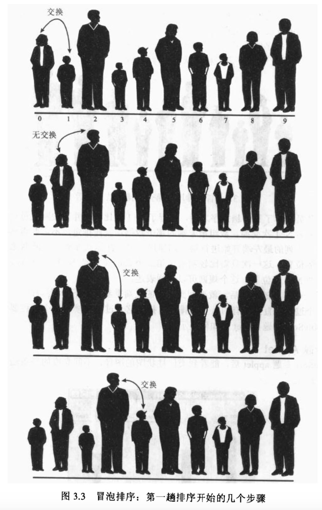
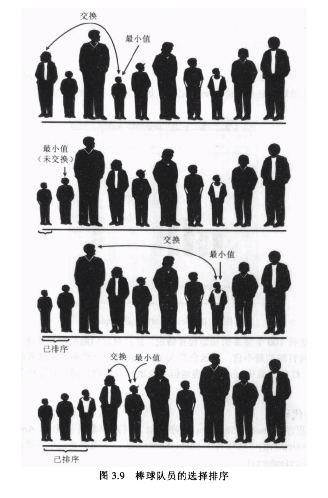
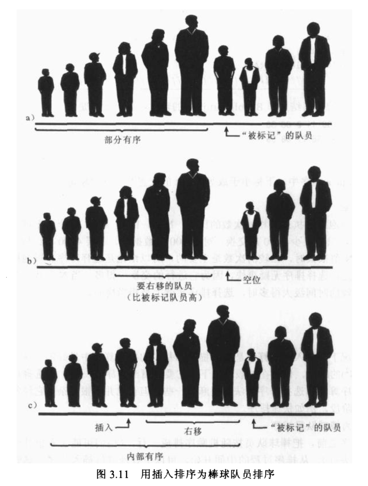

**冒泡排序**

运行速度比较慢，但是在概念上是排序算法中最简单的。


从第一项，与所有项进行比较，进行最少0次最多N-1次交换，然后从第二项开始，重复第一项做的事情，直到所有项大概进行了(N-1)+(N-2)+(N-3)+...+1=N(N-1)/2次比较后排序成功。如下图：





示例代码：

```
package simplesort;

// bubbleSort.java
// demonstrates bubble sort
// to run this program: C>java BubbleSortApp
////////////////////////////////////////////////////////////////
class ArrayBub {
    private long[] a;                 // ref to array a
    private int nElems;               // number of data items

    //--------------------------------------------------------------
    public ArrayBub(int max)          // constructor
    {
        a = new long[max];                 // create the array
        nElems = 0;                        // no items yet
    }

    //--------------------------------------------------------------
    public void insert(long value)    // put element into array
    {
        a[nElems] = value;             // insert it
        nElems++;                      // increment size
    }

    //--------------------------------------------------------------
    public void display()             // displays array contents
    {
        for (int j = 0; j < nElems; j++)       // for each element,
        {
            System.out.print(a[j] + " ");  // display it
        }
        System.out.println("");
    }

    //--------------------------------------------------------------
    public void bubbleSort() {
        int out, in;

        for (out = nElems - 1; out > 1; out--)   // outer loop (backward)
        {
            for (in = 0; in < out; in++)        // inner loop (forward)
            {
                if (a[in] > a[in + 1])       // out of order?
                {
                    swap(in, in + 1);          // swap them
                }
            }
        }
    }  // end bubbleSort()

    //--------------------------------------------------------------
    private void swap(int one, int two) {
        long temp = a[one];
        a[one] = a[two];
        a[two] = temp;
    }
//--------------------------------------------------------------
}  // end class ArrayBub

////////////////////////////////////////////////////////////////
class BubbleSortApp {
    public static void main(String[] args) {
        int maxSize = 100;            // array size
        ArrayBub arr;                 // reference to array
        arr = new ArrayBub(maxSize);  // create the array

        arr.insert(77);               // insert 10 items
        arr.insert(99);
        arr.insert(44);
        arr.insert(55);
        arr.insert(22);
        arr.insert(88);
        arr.insert(11);
        arr.insert(00);
        arr.insert(66);
        arr.insert(33);

        arr.display();                // display items

        arr.bubbleSort();             // bubble sort them

        arr.display();                // display them again
    }  // end main()
}  // end class BubbleSortApp
////////////////////////////////////////////////////////////////

执行结果：
77 99 44 55 22 88 11 0 66 33 
arr elem len:10 loop out:9 in:1 a[in]:99 > a[in + 1]:44 swap!
arr elem len:10 loop out:9 in:2 a[in]:99 > a[in + 1]:55 swap!
arr elem len:10 loop out:9 in:3 a[in]:99 > a[in + 1]:22 swap!
arr elem len:10 loop out:9 in:4 a[in]:99 > a[in + 1]:88 swap!
arr elem len:10 loop out:9 in:5 a[in]:99 > a[in + 1]:11 swap!
arr elem len:10 loop out:9 in:6 a[in]:99 > a[in + 1]:0 swap!
arr elem len:10 loop out:9 in:7 a[in]:99 > a[in + 1]:66 swap!
arr elem len:10 loop out:9 in:8 a[in]:99 > a[in + 1]:33 swap!
77 44 55 22 88 11 0 66 33 99 
arr elem len:10 loop out:8 in:0 a[in]:77 > a[in + 1]:44 swap!
arr elem len:10 loop out:8 in:1 a[in]:77 > a[in + 1]:55 swap!
arr elem len:10 loop out:8 in:2 a[in]:77 > a[in + 1]:22 swap!
arr elem len:10 loop out:8 in:4 a[in]:88 > a[in + 1]:11 swap!
arr elem len:10 loop out:8 in:5 a[in]:88 > a[in + 1]:0 swap!
arr elem len:10 loop out:8 in:6 a[in]:88 > a[in + 1]:66 swap!
arr elem len:10 loop out:8 in:7 a[in]:88 > a[in + 1]:33 swap!
44 55 22 77 11 0 66 33 88 99 
arr elem len:10 loop out:7 in:1 a[in]:55 > a[in + 1]:22 swap!
arr elem len:10 loop out:7 in:3 a[in]:77 > a[in + 1]:11 swap!
arr elem len:10 loop out:7 in:4 a[in]:77 > a[in + 1]:0 swap!
arr elem len:10 loop out:7 in:5 a[in]:77 > a[in + 1]:66 swap!
arr elem len:10 loop out:7 in:6 a[in]:77 > a[in + 1]:33 swap!
44 22 55 11 0 66 33 77 88 99 
arr elem len:10 loop out:6 in:0 a[in]:44 > a[in + 1]:22 swap!
arr elem len:10 loop out:6 in:2 a[in]:55 > a[in + 1]:11 swap!
arr elem len:10 loop out:6 in:3 a[in]:55 > a[in + 1]:0 swap!
arr elem len:10 loop out:6 in:5 a[in]:66 > a[in + 1]:33 swap!
22 44 11 0 55 33 66 77 88 99 
arr elem len:10 loop out:5 in:1 a[in]:44 > a[in + 1]:11 swap!
arr elem len:10 loop out:5 in:2 a[in]:44 > a[in + 1]:0 swap!
arr elem len:10 loop out:5 in:4 a[in]:55 > a[in + 1]:33 swap!
22 11 0 44 33 55 66 77 88 99 
arr elem len:10 loop out:4 in:0 a[in]:22 > a[in + 1]:11 swap!
arr elem len:10 loop out:4 in:1 a[in]:22 > a[in + 1]:0 swap!
arr elem len:10 loop out:4 in:3 a[in]:44 > a[in + 1]:33 swap!
11 0 22 33 44 55 66 77 88 99 
arr elem len:10 loop out:3 in:0 a[in]:11 > a[in + 1]:0 swap!
0 11 22 33 44 55 66 77 88 99 
0 11 22 33 44 55 66 77 88 99 
```


**选择排序**

选择排序改进了冒泡排序，将必要的交换次数从O(N²)减少至O(N)，不幸的是比较次数仍保持为O(N²)。

简述

​       进行选择排序就是把所有的队员扫描一遍，从中挑出（或者说选择，这正是这个排序名字的由来）最矮的一个队员。最矮的队员和站在队列最左端的队员交换位置，即站在0号位置。现在最左端的队员是有序的了，不需要再交换位置了。

​       再次扫描球队队员时，就从1号位置开始，还是寻找最矮的，然后和1号位置的队员交换。这个过程一直持续到所有队员都排定。




```
package simplesort;

// selectSort.java
// demonstrates selection sort
// to run this program: C>java SelectSortApp
////////////////////////////////////////////////////////////////
class ArraySel {
    private long[] a;                 // ref to array a
    private int nElems;               // number of data items

    //--------------------------------------------------------------
    public ArraySel(int max)          // constructor
    {
        a = new long[max];                 // create the array
        nElems = 0;                        // no items yet
    }

    //--------------------------------------------------------------
    public void insert(long value)    // put element into array
    {
        a[nElems] = value;             // insert it
        nElems++;                      // increment size
    }

    //--------------------------------------------------------------
    public void display()             // displays array contents
    {
        for (int j = 0; j < nElems; j++)       // for each element,
        {
            System.out.print(a[j] + " ");  // display it
        }
        System.out.println("");
    }

    //--------------------------------------------------------------
    public void selectionSort() {
        int out, in, min;

        for (out = 0; out < nElems - 1; out++)   // outer loop
        {
            min = out;                     // minimum
            for (in = out + 1; in < nElems; in++) // inner loop
            {
                if (a[in] < a[min])         // if min greater,
                {
                    min = in;               // we have a new min
                }
            }
            System.out.println("arr elem len:" + nElems + " loop out:" + out + " select min:" + a[min] + " swap " + a[out] + "!");
            swap(out, min);                // swap them
            display();
        }  // end for(out)
    }  // end selectionSort()

    //--------------------------------------------------------------
    private void swap(int one, int two) {
        long temp = a[one];
        a[one] = a[two];
        a[two] = temp;
    }
//--------------------------------------------------------------
}  // end class ArraySel

////////////////////////////////////////////////////////////////
class SelectSortApp {
    public static void main(String[] args) {
        int maxSize = 100;            // array size
        ArraySel arr;                 // reference to array
        arr = new ArraySel(maxSize);  // create the array

        arr.insert(77);               // insert 10 items
        arr.insert(99);
        arr.insert(44);
        arr.insert(55);
        arr.insert(22);
        arr.insert(88);
        arr.insert(11);
        arr.insert(00);
        arr.insert(66);
        arr.insert(33);

        arr.display();                // display items

        arr.selectionSort();          // selection-sort them
    }  // end main()
}  // end class SelectSortApp
////////////////////////////////////////////////////////////////

执行结果：
77 99 44 55 22 88 11 0 66 33 
arr elem len:10 loop out:0 select min:0 swap 77!
0 99 44 55 22 88 11 77 66 33 
arr elem len:10 loop out:1 select min:11 swap 99!
0 11 44 55 22 88 99 77 66 33 
arr elem len:10 loop out:2 select min:22 swap 44!
0 11 22 55 44 88 99 77 66 33 
arr elem len:10 loop out:3 select min:33 swap 55!
0 11 22 33 44 88 99 77 66 55 
arr elem len:10 loop out:4 select min:44 swap 44!
0 11 22 33 44 88 99 77 66 55 
arr elem len:10 loop out:5 select min:55 swap 88!
0 11 22 33 44 55 99 77 66 88 
arr elem len:10 loop out:6 select min:66 swap 99!
0 11 22 33 44 55 66 77 99 88 
arr elem len:10 loop out:7 select min:77 swap 77!
0 11 22 33 44 55 66 77 99 88 
arr elem len:10 loop out:8 select min:88 swap 99!
0 11 22 33 44 55 66 77 88 99 


```


不变性

从输出可以看出下标小于或等于out的位置的数据项总是有序的。

效率

选择排序和冒泡排序执行了相同的比较次数，N*(N-1)/2，一样的O(N2)运行时间，但是选择排序的交换次数随着N值的增大比冒泡排序越来越小。


**插入排序**

在大多数情况下，插入排序算法比冒泡和选择排序都要好，虽然插入排序仍需要O(N2)的时间，但是一般情况下比冒泡排序快一倍，比选择排序还要快一点，尽管它比冒泡和选择要复杂一点，但不是太复杂，经常被用在较复杂的排序算法的最后阶段，比如快速排序。

```
package simplesort;

// insertSort.java
// demonstrates insertion sort
// to run this program: C>java InsertSortApp
//--------------------------------------------------------------
class ArrayIns {
    private long[] a;                 // ref to array a
    private int nElems;               // number of data items

    //--------------------------------------------------------------
    public ArrayIns(int max)          // constructor
    {
        a = new long[max];                 // create the array
        nElems = 0;                        // no items yet
    }

    //--------------------------------------------------------------
    public void insert(long value)    // put element into array
    {
        a[nElems] = value;             // insert it
        nElems++;                      // increment size
    }

    //--------------------------------------------------------------
    public void display()             // displays array contents
    {
        for (int j = 0; j < nElems; j++)       // for each element,
        {
            System.out.print(a[j] + " ");  // display it
        }
        System.out.println("");
    }

    //--------------------------------------------------------------
    public void insertionSort() {
        int in, out;

        for (out = 1; out < nElems; out++)     // out is dividing line
        {
            long temp = a[out];            // remove marked item
            in = out;                      // start shifts at out
            while (in > 0 && a[in - 1] >= temp) // until one is smaller,
            {
                a[in] = a[in - 1];            // shift item to right
                --in;                       // go left one position
            }
            a[in] = temp;                  // insert marked item
            System.out.println("arr elem len:" + nElems + " loop:" + out + " marked:" + temp + " insert to " + in);
            display();
        }  // end for
    }  // end insertionSort()
//--------------------------------------------------------------
}  // end class ArrayIns

////////////////////////////////////////////////////////////////
class InsertSortApp {
    public static void main(String[] args) {
        int maxSize = 100;            // array size
        ArrayIns arr;                 // reference to array
        arr = new ArrayIns(maxSize);  // create the array

        arr.insert(77);               // insert 10 items
        arr.insert(99);
        arr.insert(44);
        arr.insert(55);
        arr.insert(22);
        arr.insert(88);
        arr.insert(11);
        arr.insert(00);
        arr.insert(66);
        arr.insert(33);

        arr.display();                // display items

        arr.insertionSort();          // insertion-sort them

    }  // end main()
}  // end class InsertSortApp


执行结果:
77 99 44 55 22 88 11 0 66 33 
arr elem len:10 loop:1 marked:99 insert to 1
77 99 44 55 22 88 11 0 66 33 
arr elem len:10 loop:2 marked:44 insert to 0
44 77 99 55 22 88 11 0 66 33 
arr elem len:10 loop:3 marked:55 insert to 1
44 55 77 99 22 88 11 0 66 33 
arr elem len:10 loop:4 marked:22 insert to 0
22 44 55 77 99 88 11 0 66 33 
arr elem len:10 loop:5 marked:88 insert to 4
22 44 55 77 88 99 11 0 66 33 
arr elem len:10 loop:6 marked:11 insert to 0
11 22 44 55 77 88 99 0 66 33 
arr elem len:10 loop:7 marked:0 insert to 0
0 11 22 44 55 77 88 99 66 33 
arr elem len:10 loop:8 marked:66 insert to 5
0 11 22 44 55 66 77 88 99 33 
arr elem len:10 loop:9 marked:33 insert to 3
0 11 22 33 44 55 66 77 88 99 

```

在外层的for循环中，out变量从1开始，向右移动。它标记了未排序的最左端的数据。而内层的while循环，in变量从out开始向左移动，直到temp变量小于in所指的数组数据项，或者它已经不能再向左移动为止。while循环的每一趟都向右移动了一个已排序的数据项。

执行示例图：




不变性

每趟结束后，将temp位置的项插入后，比out变量下标小的数据项都是局部有序的。

效率

第一趟排序中，最多比较一次，第二趟最多比较两次，依此类推，最后一项最多比较N-1次。因此得出1+2+3+…+N-1 = N(N-1)/2,然而每一趟排序发现插入点之前，平均只有全体数据项的一半真的进行了比较，可以得出N(N-1)/4.

总结

对于已有序或基本有序的数据来说，插入排序要好很多。当数据有序时，while循环的条件总为假，所以它变成了外层循环的一个简单语句，执行N-1次。如果数据基本有序插入排序几乎只需要O(N)的时间。然而对于逆序排序的数据，每次的比较和移动都会执行，所以插入排序不会比冒泡排序快！