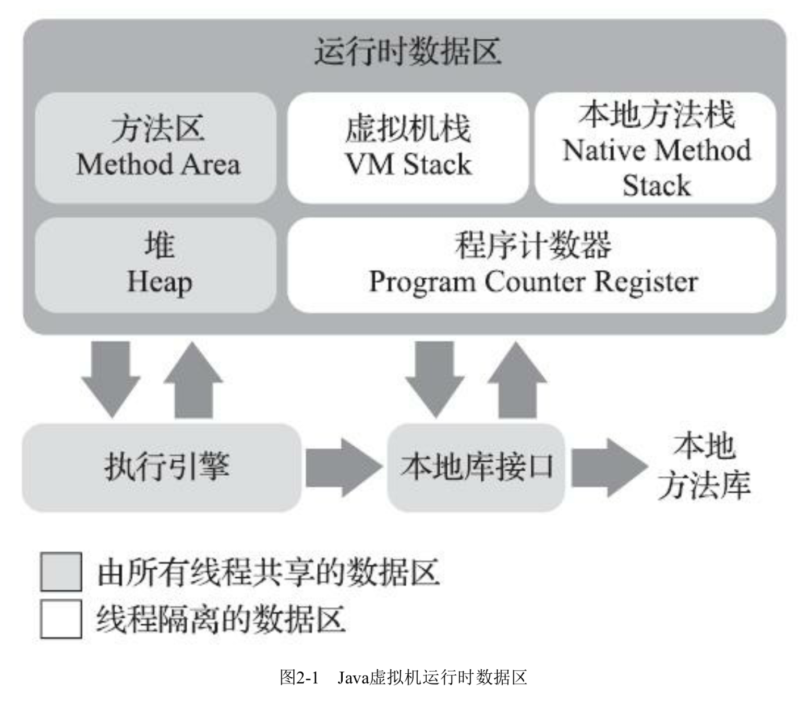
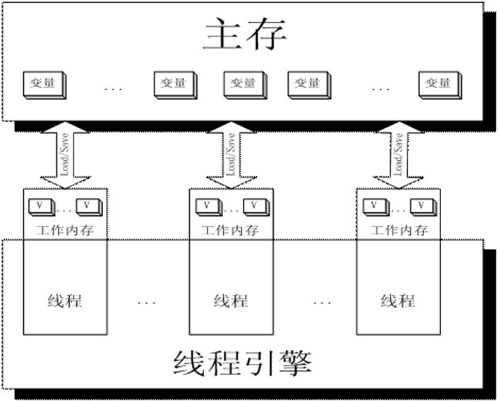

​		**java虚拟机**在执行java程序时根据《java虚拟机规范》分为下图若干个不同区域的数据区域，这些区域有各自的用途以及创建和销毁时间，有的区域随进程启动一直存在，有的区域则是依赖用户线程的启动和结束而建立和销毁。




# 程序计数器

​      程序计数器（**Program Counter Register**）是一块**较小的内存空间**，它是当前线程执行的**字节码行号指示器**。通过改变计数器的值来选取下一条需要执行的字节码指令，它是程序控制流的**指示器，分支、循环、跳转、异常、线程恢复**均依赖计数器完成 。

​      由于java是多线程轮流切换、分配处理器执行时间的方式来实现的，因此为了保证线程切换后能回到正确的执行位置，**每个线程都需要拥有一个独立的程序计数器，并且互相不受影响，独立存储**（线程私有）。

**注意**

1、如果正在执行的是本地(**Native**)方式，这个计数器值则应该为空(**Undefined**)。

2、该内存区域是唯一**无任何OutOfMemory**情况的区域。


# java虚拟机栈（java栈）

​      java虚拟机栈（**Java Virtual Machine Stack**）描述的是**Java方法执行的线程内存模型**，每个方法执行的时候Java虚拟机都会同步创建一个栈帧（**Stack Frame**）用于存储**局部变量表、操作数栈、动态连接、方法出口**等信息。每个方法被调用直至执行完毕的过程，就对应着**一个栈帧在虚拟机栈中从入栈到出栈的过程**。

​      java虚拟机栈也是**线程私有**的，生命周期与线程相同。

​      局部变量表存放了编译器可知的Java虚拟机基本数据类型（boolean、byte、char、short、int、float、long、double）、对象引用(reference类型)，这些数据类型以局部变量槽（Slot）来表示，64位的float、double类型的数据会占用两个槽，其余的只会占一个。编译期间完成内存分配，所以当进入一个方法时吗，该方法在栈帧中需要的局部变量空间是完全确定的，运行期间是不会改变局部变量表的大小（注意：大小指槽的数量）。

**异常情况**

1、如果线程请求的栈深度大于虚拟机所允许的深度，将抛出StackOverflowError异常。

2、如果虚拟机栈容量可以动态扩展，当栈扩展时无法申请到足够的内存将会抛出OutOfMemoryError异常。

**注意**

1、栈帧是方法运行时很重要的基础数据结构。 

2、HotSpot虚拟机的栈容量不可动态扩展，所以HotSpot虚拟机不会在动态扩展时导致OutOfMemoryError异常，但如果栈空间申请时就失败了，仍然会出现OOM异常。


# 本地方法栈

​        本地方法栈（**Native Method Stacks**）与虚拟机栈发挥的作用一致，虚拟机栈为执行Java方法（字节码）服务，本地方法栈则是为虚拟机使用到的本地（Native）方法服务。

**异常情况**

​        HotSpot虚拟机直接将本地方法栈和虚拟机方法栈合二为一，本地方法栈也会在栈深度溢出或栈空间申请失败时分别抛出**StackOverflowError**异常和**OutOfMemoryError**异常。


# Java堆

​        对于java应用程序，Java堆（Java Heap）是虚拟机所管理的内存中最大的一块。Java堆是所有线程共享的一块内存区域，虚拟机启动时创建。Java堆的唯一目的就是**存放对象实例**，Java 虚拟机规范中对Java堆的描述是：**所有的对象实例以及数组都应该在堆上分配**。 随着Java语言的发展，由于**即时编译技术**的进步，尤其是**逃逸分析技术**的日渐强大，**栈上分配、标量替换**优化手段已经导致了一些微妙的变化悄然发生，所以**Java对象实例都分配在堆上也渐渐不是那么绝对了**。 比如很多以Java语言编写的分布式DB已经开始直接调用unsafe native方法申请、销毁内存了。

​        在10年之前，（**以G1收集器为分界**），业界主流的HotSpot虚拟机，内部的垃圾收集器全部基于**经典分代**来设计，需要**新生代、老年代搭配工作**。但是今天，已经不同于以往，HotSpot虚拟机也出现了**不采用分代设计的新垃圾收集器**。

异常情况

Java堆即可以设置为固定大小也可以设置为可扩展，通过参数（-Xmx -Xms）设置，如果Java堆中无内存完成实例分配，并且堆也无法扩展时，将会抛出**OutOfMemoryError**异常。


**逃逸分析- 栈上分配示例**

```java
public class EscapeTest {

    public static Object globalVariableObject;

    public Object instanceObject;

    public void globalVariableEscape(){
        globalVariableObject = new Object(); //静态变量,外部线程可见,发生逃逸
    }

    public void instanceObjectEscape(){
        instanceObject = new Object(); //赋值给堆中实例字段,外部线程可见,发生逃逸
    }
    
    public Object returnObjectEscape(){
        return new Object();  //返回实例,外部线程可见，发生逃逸
    }

    public void noEscape(){
        synchronized (new Object()){
            //仅创建线程可见,对象无逃逸
        }
        Object noEscape = new Object();  //仅创建线程可见,对象无逃逸
    }

}


虚拟机配置参数：-XX:+PrintGC -Xms5M -Xmn5M -XX:+DoEscapeAnalysis

-XX:+DoEscapeAnalysis表示开启逃逸分析，JDK8是默认开启的

-XX:+PrintGC 表示打印GC信息

-Xms5M -Xmn5M 设置JVM内存大小是5M

public static void main(String[] args){
  for(int i = 0; i < 5_000_000; i++){
    createObject();
  }
}

public static void createObject(){
  new Object();
}

```

运行结果：没有GC，这说明了JVM在逃逸分析之后，将对象分配在了方法createObject()方法栈上。方法栈上的对象在方法执行完之后，栈桢弹出，对象就会自动回收。这样的话就不需要等内存满时再触发内存回收。这样的好处是程序内存回收效率高，并且GC频率也会减少，程序的性能就提高了。


# 方法区

​		方法区（**Method Area**），与Java堆一样，各个**线程共享的内存区域**，用于存储已被虚拟机加载的类型信息、常量、静态变量、即时编译后的代码缓存等数据。

​		Jvm虚拟机规范将方法区描述为堆的逻辑部分，别名（**Non-Heap**）。

**异常情况**

方法区无法满足新的内存分配需求时，将抛出**OutOfMemoryError**异常。


# 运行时常量池

​		运行时常量池（Runtime Constant Pool）是方法区的一部分。Class文件中除了类版本、字段、方法、接口等描述信息外，还包含常量池表（Constant Pool Table），存放编译期生成的各种字面量和符号引用，这些内容在类加载后存放到方法区的运行时常量池。

​		运行时常池不仅可以在编译期产生，还可以在运行时放入新的变量。例如：String类的intern()方法。

**异常情况**

同方法区


# 直接内存

​		直接内存（Direct Memory）并不是虚拟机运行时数据区的一部分，也不是《**Java虚拟机规范**》中定义的内存区域。但这部分内存可以进行频繁使用。

​		直接内存不受Java堆大小限制，受本机总内存大小的限制。

​		 JDK 1.4 中引入了 NIO 机制，为此实现了一种通过 native 函数直接分配对外内存的，而这一切是通过以下两个概念实现的：通道（Channel），缓冲区（Buffer）。

​         通过存储在 Java 堆里面的 DirectByteBuffer 对象对这块内存的引用进行操作。

​         由于避免了 Java 堆和 Native 堆（native heap）中数据复制，所以在一些场景中显著提高了性能。



**异常情况**

超过本机内存或超过使用-Direct配置了直接内存大小的限制OutOfMemoryError

