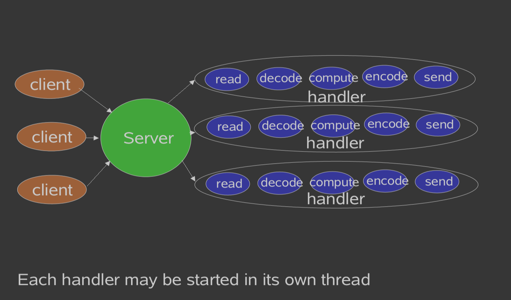

经典服务设计



经典 ServerSocket Loop

```
class Server implements Runnable {
  
  public void run() {
    try {
          ServerSocket ss = new ServerSocket(PORT);
          while (!Thread.interrupted())
            new Thread(new Handler(ss.accept())).start();
          // or, single-threaded, or a thread pool
        } catch (IOException ex) { /* ... */ }
  }
      
  static class Handler implements Runnable {
     final Socket socket;
     Handler(Socket s) { socket = s; }
     public void run() {
    		try {
            byte[] input = new byte[MAX_INPUT];
            socket.getInputStream().read(input);
            byte[] output = process(input);
            socket.getOutputStream().write(output);
        } catch (IOException ex) { /* ... */ }
     }
     private byte[] process(byte[] cmd) { /* ... */ }
  }
  
}
Note: most exception handling elided from code examples
```


可扩展性目标

1、负载增加(更多客户端)下的优雅降级

2、随着资源(CPU、内存、磁盘、带宽)的增加而不断改进

3、同时满足可用性和性能目标(短延时，满足高峰需求，可调的服务质量)	

4、分而治之通常是实现任何可伸缩性目标的最佳方法