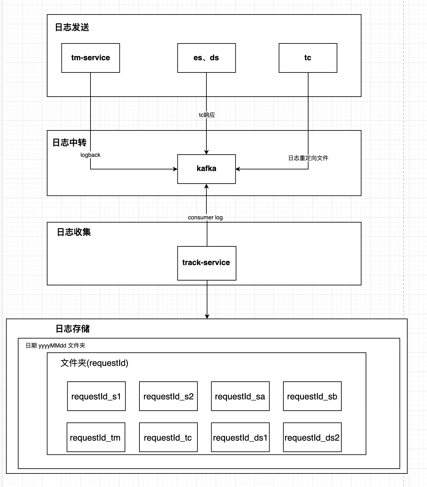
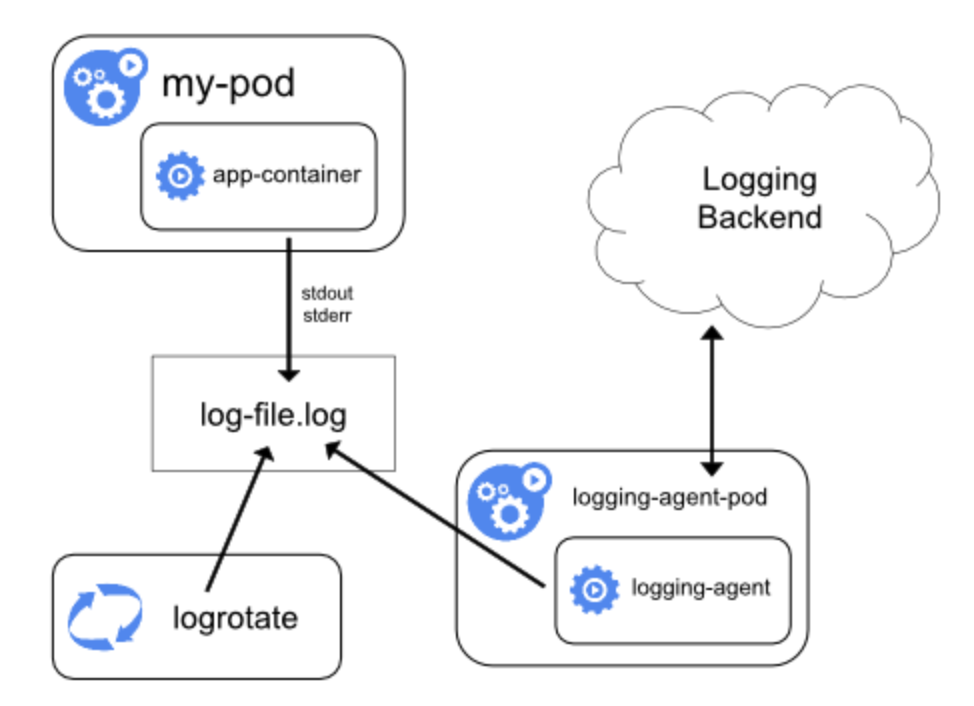
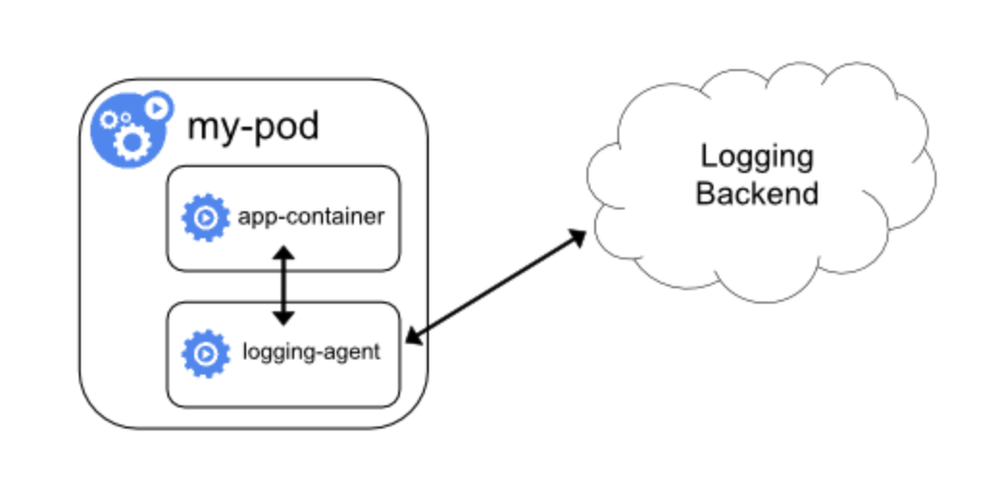

## 目前的日志方案

#### 日志方案

es、ds、tc、tm各模块自行采集日志并进行统一格式的json格式化，接入kafka作为producer发送日志，track接入kafka作为consumer，对requestId进行解析，按照日期存储至磁盘完成查询的功能。

PS:完成现状为tc统一采集了es、ds的日志并上报给tm，tm接入kafka作为producer统一发送日志，track作用如上。

#### 核心思路

仅统计业务日志，方便快速寻找问题。

#### 问题

1、链路太长

2、代码侵入性太强

3、仅包含业务日志

## 基于kubernetes的日志架构

官网：https://kubernetes.io/zh/docs/concepts/cluster-administration/logging

### kubernetes原生日志现状

1. **kubernetes原生能力不足以满足完整的日志记录方案**
   首先kubernetes api-server提供的日志查询相关的api能力非常有限，从而导致唯一的两个与kubernetes交互的工具kubectl、 kubernetes-client仅仅可以指定开始时间，最后N行日志or最近N秒的日志，无法满足实际业务需求。
2. **kubernetes没有为日志提供原生存储方案**
   如果容器崩溃、pod被驱逐、节点宕机则无法访问之前产生的容器日志。

### kubernetes提供的日志解决方案

kubernetes提供的主要日志解决方案为以下3种：

1. **原生方式**

   使用kubectl logs|kubernetes-client查看本地保留的日志，或者通过docker engine的log driver把日志重定向到文件、syslog、fluentd等系统中。

2. **集群级日志-DaemonSet方式**

   通过DaemonSet方式确保在kubernetes集群的每个node上(或指定node上)部署日志agent，由agent采集所有容器的日志到日志后端。

   

3. **集群级日志-Sidecar方式**

   在每一个需要采集日志的pod中添加一个sidecar的日志agent容器，采集该pod主容器产生的日志（emptyDir共享日志目录方式）到日志后端。

   

### 总结

目前建议采用Sidecar方式，按照官方示例使用Fluentd作为日志agent采集日志，并将日志写入Elasticsearch，解决持久化和日志分析、查询问题。

未完待续...

PS：对于大规模任务并发部署，日志量过大可能会导致Elasticsearch宕机的问题，需要进行流量削峰。

### 参考

**集群集日志**

日志应该具有独立的存储和生命周期，与节点、pod 或容器的生命周期相独立。这个概念叫 *集群级的日志* 。集群级日志方案需要一个独立的后台来存储、分析和查询日志。

**Fluentd**

Fluentd是用于统一日志记录层的开源数据收集器。

https://www.fluentd.org

**emptyDir**

用途：

- 缓存空间，例如基于磁盘的归并排序。
- 为耗时较长的计算任务提供检查点，以便任务能方便地从崩溃前状态恢复执行。
- **在 Web 服务器容器服务数据时，保存内容管理器容器获取的文件**。

https://kubernetes.io/zh/docs/concepts/storage/volumes/#emptydir

**DaemonSet**

DaemonSet对象能确保其创建的Pod在集群中的每一台（或指定）Node上都运行一个副本。

https://kubernetes.io/zh/docs/concepts/workloads/controllers/daemonset/

**SideCar**

https://www.jianshu.com/p/330b00dc40d7

