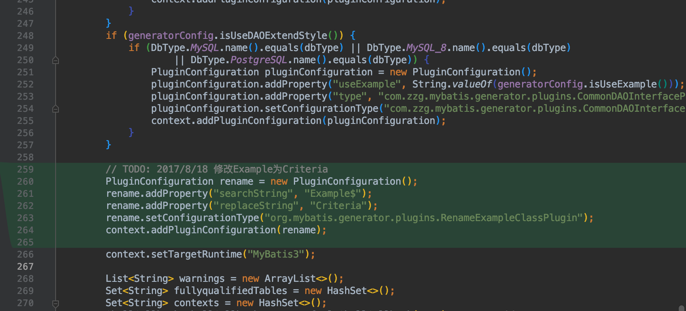
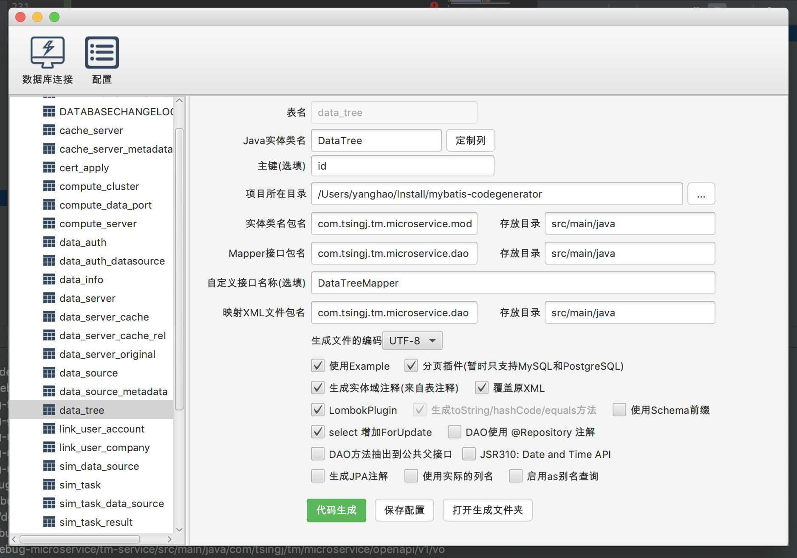

**GitHub**

https://github.com/zouzg/mybatis-generator-gui

**快速入门**

1. clone到本地

2. 添加插件修改生成的查询类名example to criteria

   

   代码如下：

   ```
   MybatisGeneratorBridge.java
   
   // TODO: 2017/8/18 修改Example为Criteria
           PluginConfiguration rename = new PluginConfiguration();
           rename.addProperty("searchString", "Example$");
           rename.addProperty("replaceString", "Criteria");
           rename.setConfigurationType("org.mybatis.generator.plugins.RenameExampleClassPlugin");
           context.addPluginConfiguration(rename);
   ```

   

3. 通过MainUI启动gui

4. 连接数据库，选择表

   

5. 按照自己需要的规则进行选择

   

6. 点击代码生成，将生成的代码贴入自己的项目中。

7. 简单查询

   ```
    DataInfoCriteria dataInfoCriteria = new DataInfoCriteria();
    DataInfoCriteria.Criteria criteria = dataInfoCriteria.createCriteria();
    if (StringUtils.isNotBlank(dataInfoQueryVOV1.getDsId())) {
    criteria.andDsIdEqualTo(dataInfoQueryVOV1.getDsId());
    }
    if (dataInfoQueryVOV1.getDataServerId() != null) {
    criteria.andDataServerIdEqualTo(dataInfoQueryVOV1.getDataServerId());
    }
    if (StringUtils.isNotBlank(dataInfoQueryVOV1.getNameEquals())) {
    criteria.andNameEqualTo(dataInfoQueryVOV1.getNameEquals());
    }
    if (StringUtils.isNotBlank(dataInfoQueryVOV1.getNameLike())) {
    criteria.andNameLike("%" + dataInfoQueryVOV1.getNameLike() + "%");
    }
    if (StringUtils.isNotBlank(dataInfoQueryVOV1.getOrganization())) {
    criteria.andOrganizationEqualTo(dataInfoQueryVOV1.getOrganization());
    }
    if (dataInfoQueryVOV1.getUserId() != null) {
    criteria.andUserIdEqualTo(dataInfoQueryVOV1.getUserId());
    }
    if (dataInfoQueryVOV1.getIsPublic() != null) {
    criteria.andIsPublicEqualTo(dataInfoQueryVOV1.getIsPublic());
    }
    if (dataInfoQueryVOV1.getNeedQuota() != null) {
    criteria.andNeedQuotaEqualTo(dataInfoQueryVOV1.getNeedQuota());
    }
   
   List<DataInfo> dataInfos = dataInfoMapper.selectByExample(dataInfoCriteria);
   
   ```

   

  