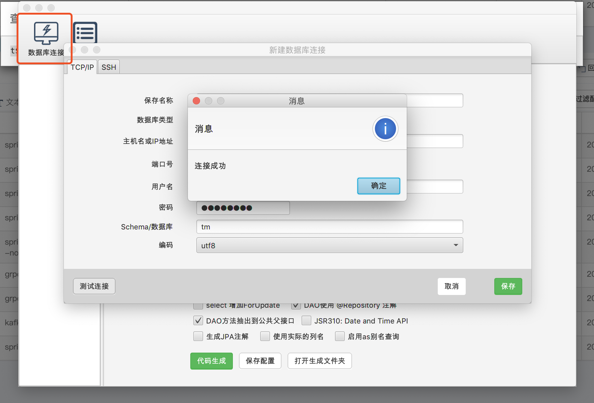

**GitHub**

https://github.com/zouzg/mybatis-generator-gui

**快速入门**

1. clone到本地

2. 添加插件修改生成的查询类名example to criteria

   

   代码如下：

   ```
   MybatisGeneratorBridge.java
   
   // TODO: 2017/8/18 修改Example为Criteria
           PluginConfiguration rename = new PluginConfiguration();
           rename.addProperty("searchString", "Example$");
           rename.addProperty("replaceString", "Criteria");
           rename.setConfigurationType("org.mybatis.generator.plugins.RenameExampleClassPlugin");
           context.addPluginConfiguration(rename);
   ```

   

3. 通过MainUI启动gui

4. 连接数据库，选择表

   

5.按照自己需要的规则进行选择


6.点击代码生成，将生成的代码贴入自己的项目中。

